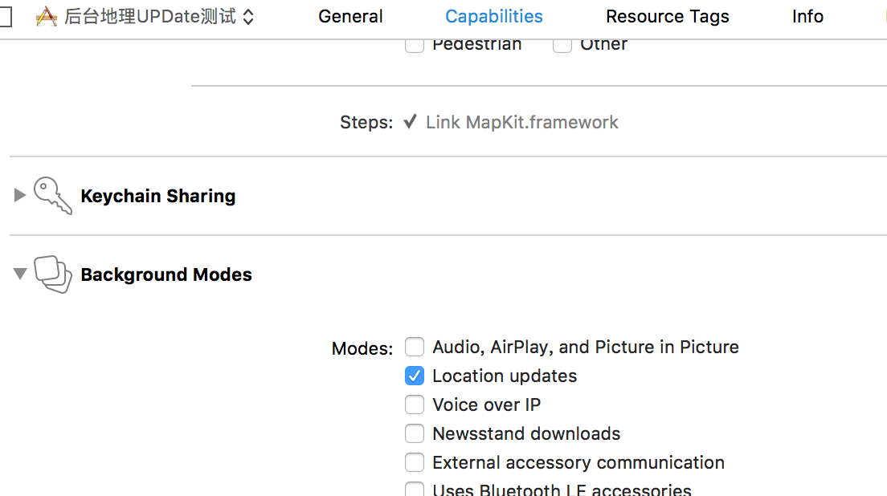
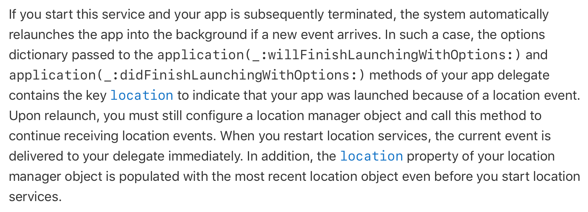
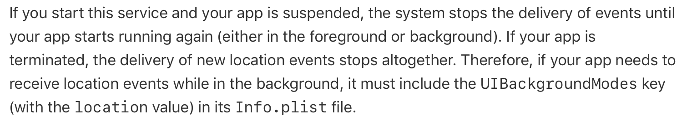

## iOS后台定位

iOS地理定位 app正常运行时可以，按下home键后app在后台也可以，双击home键后台杀死app也可以，甚至重启机器后也可以。（iOS 10 测试代码）

***

**1）设置一些请求参数**

就像正常的CLLocationManager一样申请权限以及后台更新请求

后台更新：



plist请求地理位置(需要跑始终使用)


**2）与往常一样的初始化定位管理器等步骤**

```
CLLocationManager *locationMgr = [[CLLocationManager alloc]init];
[locationMgr setAllowsBackgroundLocationUpdates:YES];

// 判断手机是否启用了定位服务
if (![CLLocationManager locationServicesEnabled]) {
    NSLog(@"定位服务当前可能尚未打开，请设置打开！");
} else {
    NSLog(@"定位服务已开启");
} 
// 如果没有授权则请求用户授权
if ([CLLocationManager authorizationStatus]==kCLAuthorizationStatusNotDetermined){
    NSLog(@"请求用户授权");
    [locationMgr requestAlwaysAuthorization];
} else {
    NSLog(@"可以使用");
    locationMgr.delegate = self;
    locationMgr.desiredAccuracy = kCLLocationAccuracyBestForNavigation;
    locationMgr.distanceFilter = 0.1;
    locationMgr.allowsBackgroundLocationUpdates = YES;
    [locationMgr startUpdatingLocation];
    [locationMgr startMonitoringSignificantLocationChanges];
}

// 如果地理位置发生了变化则走楼下回调函数
-(void)locationManager:(CLLocationManager *)manager didUpdateLocations:(NSArray<CLLocation *> *)locations{}
```

**3）设置后台与销毁状态的函数**

```
// 应用终了时调用
[[NSNotificationCenter defaultCenter]addObserver:self selector:@selector(hehe) name:@"OK" object:UIApplicationWillTerminateNotification];

// 应用后台时调用
[[NSNotificationCenter defaultCenter]addObserver:self selector:@selector(hehe) name:@"OK" object:UIApplicationDidEnterBackgroundNotification];

-(void)hehe{
    [locationMgr startMonitoringSignificantLocationChanges];
    [locationMgr startUpdatingLocation];
}
```

这样就可以了，有几点可以注意一下:

1. APP被杀死，再开机时，回调函数反应慢

2.这里有startMonitoringSignificantLocationChanges和startUpdatingLocation两个方法，一个是显著位置变化一个是正常，前者被杀死也可唤起走入回调函数，后者必须在APP没死时才可以被唤起走入回调函数。

***

附：

startMonitoringSignificantLocationChanges：

https://developer.apple.com/reference/corelocation/cllocationmanager/1423531-startmonitoringsignificantlocati



**（就是说就算被杀死也能通过显著位置变化唤起的意思）**


startUpdatingLocation：

https://developer.apple.com/reference/corelocation/cllocationmanager/1423750-startupdatinglocation



**（就是说APP被杀死就不会通过位置变化而被唤起的意思）**


可以通过这样开发一些需要APP自己启动的APP
